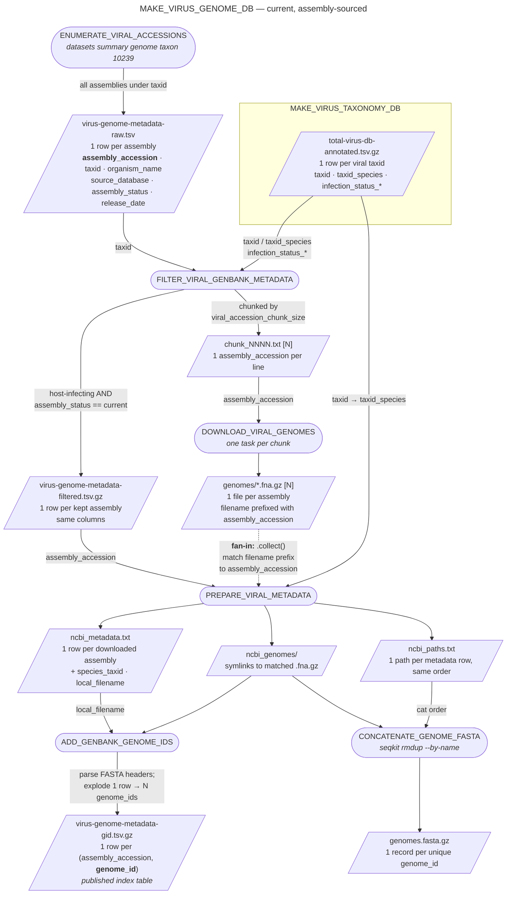
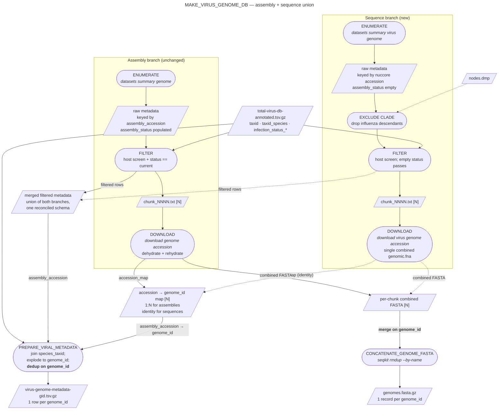

# `MAKE_VIRUS_GENOME_DB` data flow

This document traces how data and identifiers move through
`subworkflows/local/makeVirusGenomeDB/main.nf`, from the initial NCBI query to
the concatenated viral FASTA. It exists to make the join keys and file
granularity explicit, as background for extending the subworkflow to source
viral **sequence** records (`datasets summary virus genome taxon ...`) alongside
genome **assemblies** (see [#829](https://github.com/securebio/nao-mgs-workflow/issues/829)).

Everything downstream of the concatenated FASTA (`FILTER_GENOME_FASTA`,
`MASK_GENOME_FASTA`, and the Bowtie2/minimap2/Nucleaze index builds in
`MAKE_VIRUS_INDEX`) is deliberately out of scope here: those steps treat the
FASTA as a flat bag of sequences keyed by header and read no metadata columns.

## Identifiers

Four identifiers do all the work. Confusing them is the main hazard when adding
a second sourcing branch.

| Identifier | Example | What it keys | Where it comes from |
| --- | --- | --- | --- |
| `assembly_accession` | `GCA_009858895.3` | An NCBI **assembly** record. The unit of enumeration, filtering, chunking and download. | `datasets summary genome`, column `accession` |
| `genome_id` | `MN908947.3` | A single **nucleotide sequence** (nuccore accession.version). The FASTA header's first token. | Parsed out of the downloaded FASTA headers |
| `taxid` | `2697049` | The taxon NCBI assigned to the record. May be strain-level rather than species-level. | `datasets summary genome`, column `organism-tax-id` |
| `species_taxid` | `694009` | Species-level rollup of `taxid`. | `total-virus-db-annotated.tsv.gz`, via `taxid` → `taxid_species` |

The relationship that matters most: **one assembly contains one or more
sequences**, so `assembly_accession` → `genome_id` is 1:N (N > 1 for segmented
viruses, e.g. influenza). The pipeline enumerates, filters and downloads on
`assembly_accession`, but every consumer of the index — the FASTA, the aligners,
and RUN's `PROCESS_VIRAL_BOWTIE2_SAM` / `PROCESS_VIRAL_MINIMAP2_SAM` — keys on
`genome_id`. `assembly_accession` never leaves INDEX.

### Paired GenBank/RefSeq records

NCBI mints a curated RefSeq copy of many GenBank records, and the pairing runs
all the way up to the assembly. For SARS-CoV-2 isolate Wuhan-Hu-1:

| Assembly | Source | Contained `genome_id` |
| --- | --- | --- |
| `GCA_009858895.3` | GenBank | `MN908947.3` |
| `GCF_009858895.2` | RefSeq | `NC_045512.2` |

The two sequences are byte-identical; only the accessions differ. Because
`assembly_source = "all"` (the default, `configs/index.config`) enumerates both
members of the pair, and both are `assembly_status == "current"` under the same
`taxid`, **both survive filtering and both land in the FASTA under different
names**. `seqkit rmdup --by-name` does not collapse them. So the viral genome DB
currently carries one copy of the sequence per source database, and the ~4,900
"gained" genome IDs seen when the default flipped from `genbank` to `all` were
the RefSeq halves of existing pairs, not new data.

This is a *different* kind of duplication from the cross-source overlap
discussed below, and no `genome_id`-based dedup can address it: paired records
have different `genome_id`s by construction.

## Current flow (assembly sourcing)

Rounded boxes are processes; rectangles are files (`[N]` marks a per-chunk file
set). Edge labels give the key or payload carried across the edge.

### Stage by stage

**1. `ENUMERATE_VIRAL_ACCESSIONS`** — one `datasets summary genome taxon 10239
--assembly-source all` call for the whole viral root, flattened by `dataformat
tsv genome` into a **single consolidated TSV**, one row per assembly. No genome
data is fetched. The gzipped copy is published as
`virus-genome-metadata-raw.tsv.gz` for index benchmarking.

**2. `FILTER_VIRAL_GENBANK_METADATA`** — two filters, both on the consolidated
TSV:

- *Host infection.* Joins `metadata.taxid` against the virus DB on `taxid`, and
  also maps `metadata.taxid` → `taxid_species` and retries the join, so a
  strain-level accession still passes if its species is host-infecting. Keeps
  rows where any `infection_status_<host>` column is `"1"`.
- *Assembly status.* Keeps `assembly_status == "current"`, dropping
  `previous`/`replaced`/`suppressed` records that would otherwise contribute
  duplicate sequence IDs alongside the live record.

It then emits two things: the filtered table (consolidated) and the
**fan-out unit** — `chunk_NNNN.txt` files of at most
`viral_accession_chunk_size` accessions each.

**3. `DOWNLOAD_VIRAL_GENOMES`** — one task per chunk file (`.flatten()`).
Dehydrated `datasets download genome accession` + `datasets rehydrate`, then
everything is flattened into a per-task `genomes/` directory of one `.fna.gz`
per assembly, named `<assembly_accession>_<asm_name>_genomic.fna.gz`.

**4. `PREPARE_VIRAL_METADATA`** — the **fan-in barrier**: `.collect()` gathers
every chunk's genome files into one work directory. The process re-links
metadata to files by regex on the filename prefix
(`^(GC[AF]_\d+\.\d+)`), adds `species_taxid`, adds `local_filename`, drops rows
with no matching file, and emits a symlink directory plus a path list whose
line order matches the metadata row order.

**5. `ADD_GENBANK_GENOME_IDS`** — the only place `genome_id` is created. It
opens each row's FASTA and takes the first whitespace-delimited token of every
header, then **explodes** the table so there is one row per
`(assembly_accession, genome_id)`. The result,
`virus-genome-metadata-gid.tsv.gz`, is the published index table that RUN joins
alignments against on `genome_id`.

**6. `CONCATENATE_GENOME_FASTA`** — `cat` in `ncbi_paths.txt` order (not
filesystem order, so `rmdup` first-occurrence behaviour is deterministic), piped
through `seqkit rmdup --by-name`. Output: `genomes.fasta.gz`, one record per
unique `genome_id`.

### Two properties worth knowing

- **The metadata table and the FASTA are not exactly 1:1 on `genome_id`.**
  `CONCATENATE_GENOME_FASTA` dedups by name; `ADD_GENBANK_GENOME_IDS` does not,
  so a `genome_id` reachable from two assemblies appears twice in the metadata
  and once in the FASTA. Separately, the metadata branch forks *before*
  `FILTER_GENOME_FASTA`, so `genome_id`s excluded by `genome_patterns_exclude`
  remain in the published metadata table. RUN consumes the table as a
  `genome_id → (taxid, species_taxid)` dictionary
  (`process_viral_bowtie2_sam.py:171`), so extra `genome_id`s are inert and
  duplicates resolve last-wins. Neither is currently harmful — but a sequence
  branch makes cross-source `genome_id` collisions common rather than rare, and
  last-wins is not a defensible tie-break once two branches disagree.
- **Only `genome_id` crosses the INDEX boundary.** Nothing downstream reads
  `assembly_accession` or `assembly_status`, which is what makes an alternative
  sourcing branch tractable: it must produce sequences with correct
  `genome_id`/`taxid`, and need not produce assemblies.

## Adding a sequence-sourced branch

`datasets summary virus genome taxon 10239 --complete-only` queries NCBI Virus /
nuccore rather than the assembly resource. It differs from the assembly path in
four structural ways:

| | Assembly path | Sequence path |
| --- | --- | --- |
| Record key | `GCA_*`/`GCF_*` assembly accession | nuccore accession.version — i.e. **already the `genome_id`** |
| Status column | `assembly_status` (`current`/`previous`/…) | none; NCBI Virus has no assembly lifecycle |
| Download layout | `--dehydrated` + `rehydrate` → one `.fna.gz` **per accession** under `data/<accession>/` | no dehydrate; one combined `ncbi_dataset/data/genomic.fna` **per package** |
| Metadata flattener | `dataformat tsv genome`, fields `accession,organism-tax-id,organism-name,source_database,assminfo-status,assminfo-release-date` | `dataformat tsv virus-genome`, fields `accession,virus-tax-id,virus-name,sourcedb,release-date` (also `completeness`, `host-tax-id`, `segment`, `length`) |

Crucially, the FASTA headers are the same shape on both sides — `>AF104263.1
Hepatitis D virus 1 strain TW2667, complete genome` — so `genome_id` means the
same thing in both branches. That makes `genome_id` the natural merge key, and
`seqkit rmdup --by-name` in `CONCATENATE_GENOME_FASTA` the natural merge point
for the FASTA.

The diagram below shows a union design: run the two branches independently
through enumerate/filter/download, reconcile them onto one schema, and merge
once before the shared tail. Dashed nodes/edges are the new pieces.

### Where the merges actually happen

There are four distinct merge points, and they use different mechanisms:

1. **Raw metadata** (`virus-genome-metadata-raw.tsv.gz`, published for
   benchmarking) — concatenate the two branches' TSVs with a shared header. This
   requires a **reconciled schema**: keep the assembly column names and leave
   `assembly_status` empty for sequence rows, and normalise `sourcedb`
   (`RefSeq`/`GenBank`) onto the assembly path's `SOURCE_DATABASE_*` vocabulary
   and `release-date` (full ISO timestamp) onto a bare `YYYY-MM-DD`, so
   `benchmark_index.py` keeps working unchanged.
2. **Filtered metadata** — concatenate likewise. The host-infection screen needs
   no change at all: it is purely `taxid`-based, and sequence rows carry
   `virus-tax-id`. The `assembly_status == "current"` test does need to become
   "current **or empty**", otherwise every sequence row is silently dropped.
3. **FASTA** — concatenate per-chunk FASTAs and let `seqkit rmdup --by-name`
   collapse the overlap. Every sequence inside an assembly is also its own
   nuccore record *under the same accession*, so the two branches overlap almost
   completely outside the post-2025 window; this is where that overlap is
   resolved, for free. It does not resolve GenBank/RefSeq pairs, which are
   distinct accessions and are already duplicated today.
4. **`genome_id` → metadata** — the one that needs real logic. Deduping the
   FASTA is not enough; the metadata table must be deduped the same way or it
   will carry two rows (one per branch) for every overlapping genome. This means
   a deterministic tie-break — preferring the assembly-branch row keeps assembly
   provenance for genomes that have it.

The mechanical consequence of point 3 is that `DOWNLOAD_VIRAL_GENOMES` can no
longer emit one file per accession on the sequence side (the virus package is a
single `genomic.fna`), which in turn removes the filename-prefix regex that
`PREPARE_VIRAL_METADATA` uses to rebuild the assembly → sequence linkage. That
linkage has to be captured at download time instead — an explicit
`assembly_accession → genome_id` map per chunk, which is 1:N for assemblies and
the identity map for sequences. Emitting the map also removes the need to parse
FASTA headers a second time in `ADD_GENBANK_GENOME_IDS`.

### Decisions this design forces

- **Influenza.** NCBI still mints grouped assemblies for flu, and those group an
  isolate's segments into one assembly. If the sequence branch also enumerates
  flu, the same segments re-enter as ungrouped standalone records. The
  diagram assumes the flu clade is excluded from the sequence branch by
  taxonomic descent (hence the `nodes.dmp` input), keeping flu assembly-sourced.
- **RefSeq/GenBank duplicates.** The virus dataset returns both the `NC_`
  RefSeq copy and its GenBank original by default, and has no GenBank-only
  filter (only `--refseq`). Using `--refseq` would return exactly the curated
  set that already exists as assemblies, i.e. would miss the point. Note that
  the `genome_id` dedup does **not** clean this up: as above, paired records
  carry different accessions, so both survive. Suppressing one side needs an
  explicit rule keyed on the pairing (e.g. `source_database`, or the
  `assminfo-paired-assm-accession` field on the assembly side), and it is the
  same rule the assembly branch already needs — the sequence branch inherits
  the problem rather than creating it.
- **Completeness.** `--complete-only` bounds volume and matches the assembly
  path's curated notion of a genome, at the cost of dropping legitimately
  fragmentary recent deposits.
- **Volume and chunking.** The sequence resource is far larger than the assembly
  resource (SARS-CoV-2 alone has tens of thousands of recent records), so
  `viral_accession_chunk_size` and the download retry budget need revisiting.
