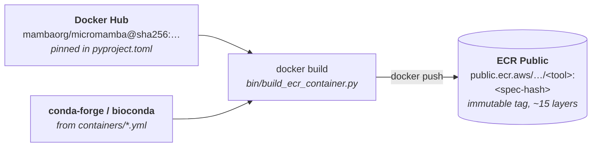
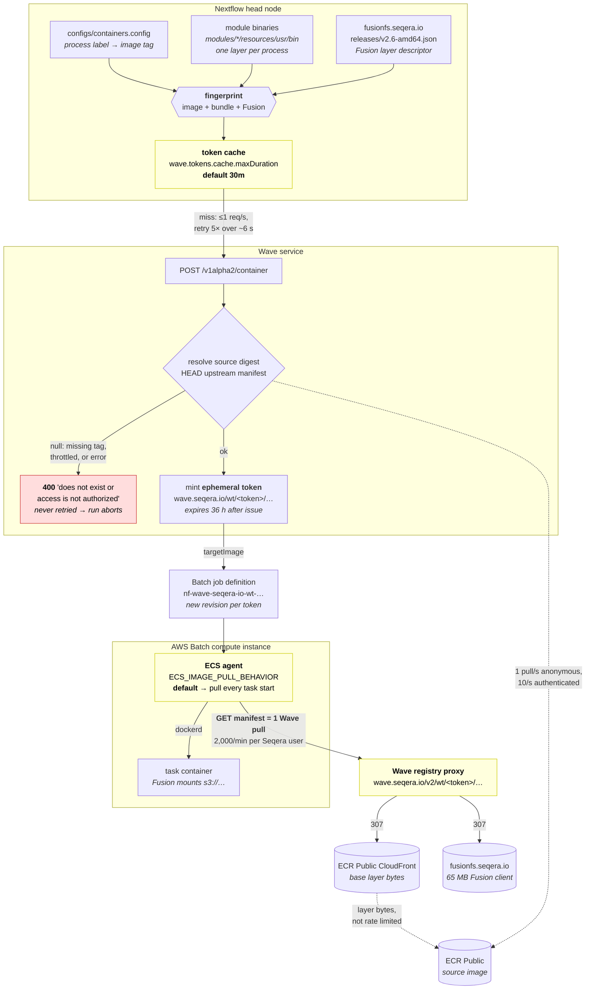

# Wave containers and pull rate limits

Production runs periodically die with one of three Wave-related errors:

```
Wave invalid response: POST https://wave.seqera.io/v1alpha2/container [429] {"message":"Request exceeded pull rate limit for user ..."}
Wave response: statusCode=400; body={"message":"Container image 'public.ecr.aws/.../python:1f76d576c5f5e441' does not exist or access is not authorized"}
Task failed to start - CannotPullContainerError: Error response from daemon: toomanyrequests: Request exceeded pull rate limit for user ...
```

This document explains what Wave is actually doing for this pipeline, where the
limits are, why we hit them, and the smallest set of changes that would stop it.

## Summary

We do not use Wave to *build* containers — `bin/build_ecr_container.py` builds them
and pushes them to our own ECR Public repository. We use Wave for exactly one
thing: it appends the Fusion client as an extra layer at pull time. Fusion cannot be
enabled without it — Nextflow refuses to start with `Fusion feature requires enabling
Wave service`. The cost of that one layer is that **Wave sits on the critical path of
every container pull in every task**, and its rate limits become ours.

Three properties of the current setup multiply how much of that limit we consume:

| # | Root cause | Effect |
|---|---|---|
| 1 | Wave hands out an **ephemeral token** per request, and Nextflow re-requests one every **30 minutes** (`wave.tokens.cache.maxDuration`) | The image *name* changes mid-run, so every host's image cache is invalidated and a new Batch job definition is registered |
| 2 | `nextflow.enable.moduleBinaries` gives **each process its own Wave container**, not each image | ~47 distinct Wave containers per cache window, not the 27 in `configs/containers.config` |
| 3 | ECS's default image-pull behaviour re-pulls the manifest on **every task start** | One Wave "pull" per task, even when the image is already on the instance |

And two properties make the failure fatal rather than transient:

| # | Root cause | Effect |
|---|---|---|
| 4 | Nextflow retries a Wave `429` five times over **~6 seconds**, then aborts the whole session | A rate limit that clears in a minute kills a multi-hour run |
| 5 | Nextflow **never** retries a Wave `400`, but Wave returns `400` for transient upstream failures | One throttled digest lookup inside Wave aborts the run |

The 80:20 fix is a handful of config lines in `configs/profiles.config` plus one line
in the Batch launch template. See [Proposed fixes](#proposed-fixes).

## The dependency chain

Two questions worth answering up front, because the error messages don't make it
obvious: **Docker Hub is not in the runtime path at all** (it is a build-time
dependency only), and **layer bytes never flow through Wave** — Wave serves the
manifest and `307`-redirects every blob to ECR Public's CloudFront distribution or
to `fusionfs.seqera.io`. Wave is a control-plane dependency, not a bandwidth one.
That is also why its limit is counted in manifests: a 15-layer image is one "pull".

Build time, run by hand whenever a `containers/*.yml` spec changes. This is the only
point at which Docker Hub is involved:



Run time. Everything below happens on every run; the highlighted boxes are where the
limits bite:



## Where the limits are

| Service | Limit | Notes |
|---|---|---|
| Wave, authenticated | 250 builds/hour, **2,000 pulls/minute** | A "pull" is one *manifest* request; layers and blobs are free. A 15-layer image is 1 pull. |
| Wave, anonymous | 25 builds/day, 100 pulls/hour | Counted per source IP, which is why the unauthenticated form of the error names an IP. |
| ECR Public, unauthenticated | 1 pull/second, **not adjustable** | Applies to Wave's own upstream digest lookups. |
| ECR Public, authenticated | 10 pulls/second, adjustable | Requires ECR credentials registered in Seqera. |

The Wave quota is **per Seqera user**, aggregated across every concurrent run. The
production 429s name a user, not a run — one delivery's fan-out can starve another's.

## Root causes

### 1. Ephemeral tokens churn every 30 minutes

Wave's response to `POST /v1alpha2/container` is not deterministic. Three identical
requests for an unchanged image returned three different tokens, hence three
different image URLs. Nextflow papers over this with an in-memory cache
(`WaveClient.cache`), but that cache is built with
`expireAfterWrite(wave.tokens.cache.maxDuration)`, defaulting to **30 minutes**.

In a real pipeline, tasks are created continuously as upstream processes finish, so
the cache expires and re-fills for the whole life of the run. Every refill produces
a *new image name* for byte-identical content, which:

- invalidates the Docker image cache on every instance (the name is the cache key),
- makes `ECS_IMAGE_PULL_BEHAVIOR=prefer-cached` useless on its own,
- registers a new AWS Batch job definition,
- and costs a fresh manifest pull from every instance that runs it.

This matches the timing of the failure that prompted this investigation: the run made
its first Wave requests at `14:10`, and the `CannotPullContainerError` storm and the
`429` both landed at `14:38` — one cache window later.

Note this does **not** affect `-resume`: the task hash uses the Wave *fingerprint*
(`ContainerInfo.hashKey`), not the token URL.

### 2. Module binaries multiply the container count

`configs/profiles.config` sets `nextflow.enable.moduleBinaries = true`, and 33 of our
modules carry a `resources/usr/bin` bundle. Wave packs each bundle into its own layer,
so the fingerprint is per *process*, not per *image*:

| | count |
|---|---|
| processes | 98 |
| … with module binaries → one Wave container each | 33 |
| … without, spanning 14 distinct images | 65 |
| **distinct Wave containers per cache window** | **~47** |

So the unit of Wave traffic is ~47, not the 27 labels in `configs/containers.config`.

### 3. Every task start is a fresh manifest pull

The ECS agent's `ECS_IMAGE_PULL_BEHAVIOR` defaults to `default`: "the image/digest
will be pulled remotely, if the pull fails then the cached image/digest on the
instance will be used". A `docker pull` of an already-present image still fetches the
manifest — verified by blackholing the registry, at which point pulling a cached
image fails outright. Under `default`, therefore, **each task start costs one Wave
pull**, even for the hundredth task of the same image on the same instance.

`once` and `prefer-cached` skip the pull entirely when the image is already present.
`prefer-cached` additionally disables automated image cleanup on the instance.

### 4. The Wave retry window is ~6 seconds

`wave.retryPolicy` defaults to `maxAttempts = 5`, `delay = 450ms`, `multiplier = 2`,
`maxDelay = 90s`. Measured against a stub Wave that always answers `429`, Nextflow
made 5 attempts spanning **6.4 seconds** and then threw `BadResponseException`, which
aborts the session. No process-level `errorStrategy` applies — this happens during
container resolution, not task execution.

Six seconds is the wrong order of magnitude for an account-wide, per-minute quota.

### 5. A Wave `400` is never retried — and Wave uses `400` for transient failures

Wave resolves the source image digest on *every* container request
(`ContainerController.makeRequestData` → `RegistryProxyService.getImageDigest`). That
method catches **every** exception and returns `null`, and a `null` digest becomes:

> `Container image '…' does not exist or access is not authorized`

So a missing tag, a credential problem, an upstream `429` from ECR Public, and a
network blip are all reported identically — and Nextflow retries `400` **zero** times
(verified: one request, immediate abort).

The tag from the production error, `python:1f76d576c5f5e441`, resolves in ECR Public
today and Wave returns `200` for it today. It was never missing, and our repository is
public, so this was not a credentials problem either. The advice currently in
[troubleshooting.md](./troubleshooting.md) — register ECR credentials in Seqera — is
worth doing (it raises Wave's own upstream limit from 1 to 10 pulls/second) but is not
the cause of that error.

### 6. Task-level retries have no backoff

`configs/profiles.config` sets `errorStrategy = "retry"` with `maxRetries = 1`.
`CannotPullContainerError: … toomanyrequests` is classified as retryable by
`AwsBatchTaskHandler` (only reasons containing `unauthorized` are unrecoverable), so
the retry does fire — but Nextflow resubmits immediately, so both attempts usually
land inside the same throttled window.

## Empirical results

Measurements on Nextflow `26.04.6` unless noted. Methods are described inline, and
every number below is reproducible against public endpoints and this repository's own
container tags.

### Wave request and pull anatomy

| Observation | Result |
|---|---|
| 3 identical `POST /v1alpha2/container` for an unchanged image | 3 **different** tokens / image URLs |
| Token lifetime (`expiration` − request time) | **36 hours**, measured twice |
| Manifest served by Wave with no `containerConfig` | byte-identical to the ECR Public manifest (same 15 layer digests) |
| Manifest served with the Fusion `containerConfig` | 16 layers — exactly one appended, 65,304,313 B, the Fusion v2.6 amd64 client |
| Base-layer blob request to Wave | `307` → ECR Public CloudFront |
| Fusion-layer blob request to Wave | `307` → `fusionfs.seqera.io` |

### What a `docker pull` actually costs

| Scenario | Wall time | Layer bytes | Manifest fetched? |
|---|---|---|---|
| Cold pull | 2.32 s | all 15 layers | yes |
| Same content, **different** Wave token | 0.78 s | none (content-addressed reuse) | **yes** |
| Same token again ("Image is up to date") | 0.50 s | none | **yes** |
| Same token, registry blackholed in `/etc/hosts` | — | — | **fails** |

Token churn is therefore cheap in bandwidth and expensive in quota: it costs no layer
transfer but a full manifest pull, which is the thing that is rate limited.

### Token churn A/B, local executor

Same pipeline, tasks created steadily over 7 minutes, one container:

| `wave.tokens.cache.maxDuration` | Wave requests | distinct image URLs |
|---|---|---|
| `1m` | 7 | 7 |
| `24h` | **1** | **1** |

### Token churn A/B, AWS Batch

Same pipeline on AWS Batch: 18 staggered rounds creating 54 tasks across two
containers over ~40 minutes. Both arms completed with zero task failures; only
`wave.tokens.cache.maxDuration` differs between them.

| Arm | Wave requests | Batch job definitions registered |
|---|---|---|
| `2m` (compressed stand-in for the 30m default) | 15 | 15 |
| `24h` | **2** | **2** |

The same pair run on Nextflow `25.10.5` gave 13 vs 2 — this is not a version-specific
behaviour. Note the second column: every new token also registers a new Batch job
definition, so token churn consumes Batch API calls and job-definition quota too.

### Module binaries multiply the count

Three processes, one image, `nextflow.enable.moduleBinaries = true`; two of the three
carry a `resources/usr/bin` bundle:

| | result |
|---|---|
| distinct container images | 1 |
| distinct Wave container requests | **3** |

### Retry behaviour against a stub Wave

| Stub response | Config | Attempts | Span | Outcome |
|---|---|---|---|---|
| `429` | default | 5 | 6.4 s | session aborted |
| `429` | `wave.retryPolicy.maxAttempts = 10` | 10 | **191 s** | session aborted |
| `400` | default | **1** | 0 s | session aborted immediately |

Observed backoff with `maxAttempts = 10`: 0.42, 1.11, 1.74, 4.02, 8.04, 16.86, 30.81,
47.09, 80.47 s — exponential with jitter, capped at `maxDelay`.

### Not reproduced

We did not trigger a Wave `429` ourselves. 150 anonymous container requests issued in
3 seconds (≈3,000/min) all returned `200`, and we stopped there rather than
deliberately exhausting a shared quota. The 2,000 pulls/minute figure is Seqera's
documented limit, not a measured one.

## Proposed fixes

Ordered by benefit per unit of risk.

### 1. Stop the token churn — `configs/profiles.config`

```groovy
// Wave mints a new ephemeral image URL per request; re-requesting every 30 min
// (the default) invalidates every instance's image cache mid-run. Tokens live 36 h.
wave.tokens.cache.maxDuration = '24h'
```

One line, and it collapses per-container Wave traffic to once per run. It is the
prerequisite for fix 3 doing anything, because `prefer-cached` can only hit when the
image name is stable. Keep the value comfortably under the 36 h token lifetime.

Two caveats. The option is undocumented, so Nextflow 26.04.6 logs
`WARN Unrecognized config option 'wave.tokens.cache.maxDuration'` — it is nonetheless
applied (`WaveConfig` reads it via `opts.navigate`, which the config validator doesn't
see), confirmed in every run above by the `tokensCacheMaxDuration` value in the
`Wave config:` debug line. And being undocumented, it could be renamed without a
deprecation cycle, so it is worth re-checking on Nextflow upgrades.

### 2. Widen the retry windows — `configs/profiles.config`

```groovy
// A per-minute account quota needs a retry window measured in minutes, not seconds.
wave.retryPolicy.maxAttempts = 10   // ~3 min instead of ~6 s

process {
    errorStrategy = { sleep(Math.pow(2, task.attempt) * 2000 as long); return 'retry' }
    maxRetries    = 5
}
```

The `errorStrategy` closure is the idiom from the Nextflow docs. It replaces the bare
`errorStrategy = "retry"` / `maxRetries = 1` in the Batch profiles, and gives
`CannotPullContainerError` retries 4 s / 8 s / 16 s / 32 s / 64 s of separation instead
of resubmitting immediately. It also helps spot reclamations, which are retried today
with the same zero delay.

There is no useful pattern to match on: "Task failed to start" carries no exit status,
and the retryable/unrecoverable split for `CannotPullContainerError` is already made
inside `AwsBatchTaskHandler` before `errorStrategy` sees the task. A general backoff is
both simpler and strictly better than the current behaviour.

### 3. Stop re-pulling per task — Batch launch template

Set on the ECS agent in the launch template's user data (this lives in
`nao-aws-terraform/batch-template`, not in this repo):

```
ECS_IMAGE_PULL_BEHAVIOR=prefer-cached
```

With fix 1 in place, the image name is stable for the whole run, so the second and
subsequent tasks using an image on a given instance skip the registry entirely. That
turns "one Wave pull per task" into "one Wave pull per image per instance", and it
needs no pipeline change.

How big that win is depends on how densely production packs tasks onto instances,
which we did not measure — our test workload was too small and too sparse to be
representative. The mechanism is certain; the multiplier is not.

`prefer-cached` also disables automated image cleanup on the instance, which is fine
for Batch instances that are torn down after the run but is worth checking against the
root volume size on long-lived compute environments.

### 4. Take Wave out of the pull path entirely — `wave.freeze`

The complete fix. With freeze mode Wave builds the Fusion-augmented image *once* and
pushes it to a repository we own, and Nextflow then hands Batch a stable URL in our own
registry:

```groovy
wave.enabled          = true
wave.freeze           = true
wave.build.repository = '<our ECR repo>'
```

Wave then makes at most one API call per container per content change, and task pulls
go straight to ECR with no Wave involvement and no Wave quota. Freeze is compatible
with Fusion: Wave rewrites the augmentation into the build (`freezeService.freezeBuildRequest`),
so the Fusion layer is baked in.

This is larger than the other three: it needs push credentials for the target registry
registered in Seqera Platform, a decision about which repository to write to, and a
cache repository for build layers. Worth doing, but not the 80:20.

**`wave.mirror` is not an alternative.** Mirror copies the source image "with the same
name, tag, and checksum", which cannot carry the Fusion layer — Nextflow drops the
container config with a warning when both are set. Enabling mirror would silently
disable Fusion.

### 5. Register ECR credentials in Seqera

Already recommended by [troubleshooting.md](./troubleshooting.md), and still worth
doing — not for the reason given there, but because it raises the ceiling on Wave's own
upstream digest lookups from 1 to 10 pulls/second, which is what the `400` in root
cause 5 is most likely bumping into.

## References

- [Reduce Wave API calls](https://docs.seqera.io/wave/guides/reduce-api-calls)
- [Wave API limits](https://docs.seqera.io/wave/api#api-limits)
- [`wave` configuration scope](https://docs.seqera.io/nextflow/reference/config/wave)
- [Amazon ECS container agent configuration](https://github.com/aws/amazon-ecs-agent/blob/master/README.md)
- [Amazon ECR Public service quotas](https://docs.aws.amazon.com/AmazonECR/latest/public/public-service-quotas.html)
- [`errorStrategy` retry with backoff](https://docs.seqera.io/nextflow/reference/process#errorstrategy)
