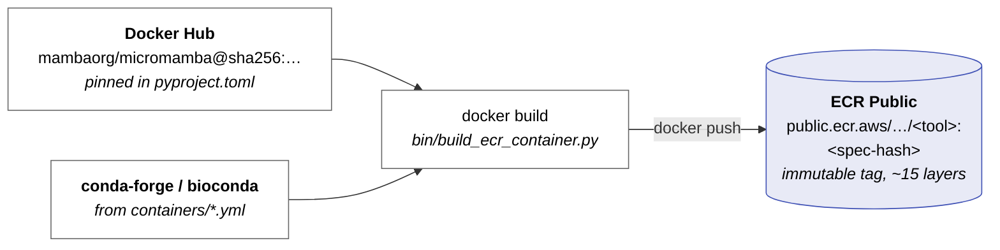
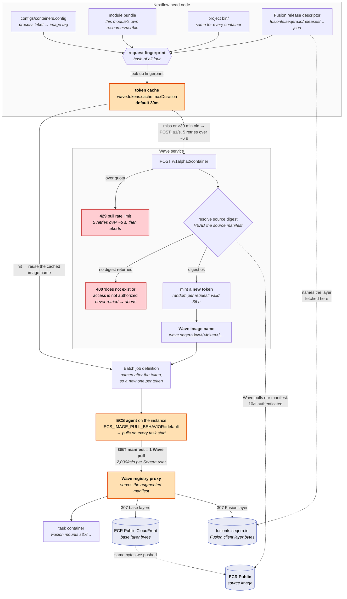

# Wave containers and pull rate limits

Production runs periodically die with one of three Wave-related errors:

```
Wave invalid response: POST https://wave.seqera.io/v1alpha2/container [429] {"message":"Request exceeded pull rate limit for user ..."}
Wave response: statusCode=400; body={"message":"Container image 'public.ecr.aws/.../python:1f76d576c5f5e441' does not exist or access is not authorized"}
Task failed to start - CannotPullContainerError: Error response from daemon: toomanyrequests: Request exceeded pull rate limit for user ...
```

This document explains what Wave is actually doing for this pipeline, where the
limits are, why we hit them, and the smallest set of changes that would stop it.
It assumes the Seqera and ECR credentials from the
[installation guide](./installation.md) are configured, so only authenticated
limits apply.

## Summary

We do not use Wave to *build* containers — `bin/build_ecr_container.py` builds them
and pushes them to our own ECR Public repository. We use Wave for exactly one thing:
it appends the Fusion client as an extra layer at pull time. Fusion cannot be enabled
without it (Nextflow aborts with `Fusion feature requires enabling Wave service`). The
cost of that one layer is that **Wave sits on the critical path of every container
pull in every task**, and its 2,000 pulls/minute quota becomes ours.

Measured on a real 83-minute RUN of 19,976 tasks (see
[Empirical results](#empirical-results)):

| | |
|---|---|
| Manifest pulls the run made against Wave | **19,976** — one per task |
| Peak pull rate | **1,039/min**, against a 2,000/min quota |
| Pulls actually needed (one per image per instance) | **1,795** — an 11× overshoot |

A single RUN peaks at about half the account quota. The quota is **per Seqera user,
shared across every concurrent run**, so two runs in parallel — main and stable, which
we do routinely — is enough to exceed it. That is the whole story behind the `429`s.

Three properties of the current setup produce that overshoot:

| # | Root cause | Effect |
|---|---|---|
| 1 | ECS's default image-pull behaviour re-pulls the manifest on **every task start** | One Wave pull per task, even for the 400th task of the same image on the same instance |
| 2 | Wave mints a **new, uniquely-named image** on every request, and Nextflow re-requests one every 30 minutes | The image *name* changes mid-run, defeating any host-side image cache and registering a new Batch job definition each time |
| 3 | Fusion makes Nextflow bundle each module's `resources/` into the image, so the unit is the **process**, not the image | 26 distinct Wave containers in that run for 14 underlying images |

And two properties make the failure fatal rather than transient:

| # | Root cause | Effect |
|---|---|---|
| 4 | Nextflow retries a Wave `429` five times over **~6 seconds**, then aborts the whole session | A per-minute quota needs a per-minute retry window |
| 5 | Nextflow **never** retries a Wave `400`, but Wave returns `400` for transient upstream failures | One throttled digest lookup inside Wave aborts the run |

See [Proposed fixes](#proposed-fixes).

## Terminology

The error messages and the Seqera UI use several similar-sounding terms for different
things. In the order Wave uses them:

| Term | What it is |
|---|---|
| **Source image** | The image we built and pushed, e.g. `public.ecr.aws/…/coreutils:e405c169027d032d`. Also shown as "Request container" / "Container image". |
| **Manifest** | The small JSON document listing an image's layers. Pulling it is one registry round trip, and it is the unit Wave rate-limits. |
| **Digest** | The `sha256:…` content hash of a manifest. "Container digest" is the source image's; "Wave digest" is the augmented image's, and they differ because Wave added a layer. |
| **Request fingerprint** | A hash Nextflow computes over (source image + module bundle + Fusion layer + platform). It is Nextflow's **client-side cache key**. Wave records it but does not act on it. |
| **Token** | A short random string Wave mints **per request**, e.g. `5eefc1e826d5`. |
| **Wave image** | The name Batch actually pulls: `wave.seqera.io/wt/<token>/<source path>:<tag>`. Same tag as the source, but a new `wt/<token>/` segment each time. Called `targetImage` in the API response. |
| **Expiration** | How long a token stays valid: **36 hours** after it is minted. Unrelated to Nextflow's 30-minute cache (see [root cause 2](#2-wave-renames-the-image-on-every-request-and-nextflow-re-requests-every-30-minutes)). |

## The dependency chain

Two questions worth answering up front, because the error messages don't make it
obvious: **Docker Hub is not in the runtime path at all** (it is a build-time
dependency only), and **layer bytes never flow through Wave** — Wave serves the
manifest and `307`-redirects every blob to ECR Public's CloudFront distribution or to
`fusionfs.seqera.io`. Wave is a control-plane dependency, not a bandwidth one. That is
also why its limit is counted in manifests: a 15-layer image is one "pull".

Build time, run by hand whenever a `containers/*.yml` spec changes. This is the only
point at which Docker Hub is involved:



Run time. **Orange** marks the three places a rate limit is consumed or amplified;
**red** marks the two responses that end the run outright:



## Where the limits are

| Service | Limit (authenticated) | Notes |
|---|---|---|
| Wave pulls | **2,000/minute** | Per Seqera user, shared across concurrent runs. A "pull" is one *manifest* request; layers and blobs are free, so a 15-layer image is 1 pull. |
| Wave builds | 250/hour | Not relevant to us: we never ask Wave to build. |
| ECR Public pulls | 10/second (adjustable) | Applies to Wave's own digest lookups against our registry, not to our tasks. |

Unauthenticated, the same limits are 100 pulls/hour and 1 ECR Public pull/second; that
is why the error sometimes names an IP instead of a user.

## Root causes

### 1. Every task start is a fresh manifest pull

The ECS agent's `ECS_IMAGE_PULL_BEHAVIOR` defaults to `default`: "the image/digest will
be pulled remotely, if the pull fails then the cached image/digest on the instance will
be used". A `docker pull` of an already-present image still fetches the manifest —
verified by blackholing the registry in `/etc/hosts`, at which point pulling a
fully-cached image fails outright.

So under `default`, pulls = tasks. In the measured run that is 19,976 pulls where 1,795
would do. This is the single largest factor, and it is fixed outside this repository.

### 2. Wave renames the image on every request, and Nextflow re-requests every 30 minutes

Wave's response to `POST /v1alpha2/container` is not deterministic: it mints a fresh
random token per request and returns `wave.seqera.io/wt/<token>/…` as the image name.
Nextflow papers over this with an in-memory cache keyed on the request fingerprint, but
that cache is built with `expireAfterWrite(wave.tokens.cache.maxDuration)`, defaulting
to **30 minutes**. Because tasks are created continuously as upstream processes finish,
the cache expires and refills for the whole life of the run.

The Seqera containers view for any of our runs shows this directly — two requests for
the same container, 31 minutes apart, with an *identical* fingerprint and different
tokens:

| Token | Fingerprint | Timestamp | Expiration |
|---|---|---|---|
| `5eefc1e826d5` | `04658e7c…b657` | 07:55 | next day 19:55 |
| `499b276f43ad` | `04658e7c…b657` | 08:26 | next day 20:26 |

Note the two clocks are unrelated: each **token stays valid for 36 hours**, but
Nextflow throws it away after **30 minutes** and asks for another. Nothing expired; the
client just stopped using a perfectly good name.

Each new name:

- gives every instance a cache miss on a name it has never seen (the layers are
  content-addressed, so no bytes move — but the manifest pull is the thing that counts);
- registers a new AWS Batch job definition, since Nextflow derives the job-definition
  name from the image name;
- costs 754 extra manifest pulls in the measured run, 42% above the floor.

This also matches the timing of the failure that prompted this investigation: the run
made its first Wave requests at `14:10` and the `CannotPullContainerError` storm and the
`429` both landed at `14:38` — one cache window later.

It does **not** affect `-resume`: the task hash uses the fingerprint
(`ContainerInfo.hashKey`), not the image name.

### 3. Fusion turns each module into its own Wave container

Enabling Fusion makes Nextflow set `wave.bundleProjectResources = true` and disable the
remote bin directory (`WaveFactory.checkWaveRequirement`), so the pipeline's `bin/` is
shipped as a container layer instead of being staged at runtime. On top of that,
`nextflow.enable.moduleBinaries = true` ships each module's own binaries as a second
layer. The scope of that second bundle is
`scriptPath.resolveSibling('resources')` (`ScriptMeta.getModuleBundle`) — the
`resources/` directory **next to that module's `main.nf`**, and nothing else.

So `ADD_FIXED_COLUMN` gets an image containing the `python` base + the project `bin/` +
*only* `modules/local/addFixedColumn/resources/usr/bin/*`. `ADD_SAMPLE_COLUMN` gets a
different image with only its own script. There is no shared `python` container:

| | count |
|---|---|
| processes in the repo | 97 |
| … with a module bundle → one Wave container each | 32 |
| … without, sharing 21 distinct images | 65 |
| **distinct Wave fingerprints, whole repo** | **53** |
| of which use the `python` image | 23 |

The project `bin/` layer is identical everywhere, so it does not multiply anything; the
per-module layer does.

### 4. The Wave retry window is ~6 seconds

`wave.retryPolicy` defaults to `maxAttempts = 5`, `delay = 450ms`, `maxDelay = 90s`,
`jitter = 0.25`. Measured against a stub Wave that always answers `429`, Nextflow made
5 attempts spanning **6.4 seconds** and then threw `BadResponseException`, which aborts
the session. No process-level `errorStrategy` applies — this happens during container
resolution, not task execution.

Six seconds is the wrong order of magnitude for a per-minute quota.

### 5. A Wave `400` is never retried — and Wave uses `400` for transient failures

Wave resolves the source image digest on *every* container request
(`ContainerController.makeRequestData` → `RegistryProxyService.getImageDigest`). That
method catches **every** exception and returns `null`, and a `null` digest becomes:

> `Container image '…' does not exist or access is not authorized`

So a missing tag, a credential problem, an upstream `429` from ECR Public, and a network
blip are all reported identically — and Nextflow retries `400` **zero** times (verified:
one request, immediate abort).

The tag from the production error, `python:1f76d576c5f5e441`, resolves in ECR Public
today and Wave returns `200` for it today. It was never missing, and the repository is
public, so this was not a credentials problem either.

### 6. Task-level retries have no backoff

`configs/profiles.config` sets `errorStrategy = "retry"` with `maxRetries = 1`.
`CannotPullContainerError: … toomanyrequests` is classified as retryable by
`AwsBatchTaskHandler` (only reasons containing `unauthorized` are unrecoverable), so the
retry does fire — but Nextflow resubmits immediately, so both attempts can land inside
the same throttled window.

## Empirical results

Measurements on Nextflow `26.04.6` unless noted, plus three production RUN traces from
`output/logging/trace_*.tsv`.

### Production: what a run actually costs Wave

| | 2026-07-20 | 2026-07-27 | 2026-08-03 |
|---|---|---|---|
| tasks | 14,156 | 16,705 | 19,978 |
| wall clock | 57 min | 43 min | 83 min |
| distinct Wave image URLs | 28 | 28 | 44 |
| distinct underlying images | 14 | 14 | 14 |
| manifest pulls (= tasks) | 14,156 | 16,705 | 19,978 |
| **peak pulls/minute** | **924** | **1,126** | **1,039** |
| peak as % of the 2,000/min quota | 46% | 56% | 52% |

One run is not enough to breach the quota; two overlapping runs are.

### Production: the two multipliers, separated

Joining the 2026-08-03 trace against the Batch job records for all 19,976 tasks:

| | |
|---|---|
| compute instances used | 223 |
| tasks per instance | mean 89.6, median 51, max 447 |
| manifest pulls today (one per task) | 19,976 |
| … with `prefer-cached`, today's churning names | 2,549 (7.8× fewer) |
| … with `prefer-cached` **and** stable names | **1,795 (11.1× fewer)** |
| pulls attributable purely to token churn | 754 |

The distinct-URL count is predictable from the two mechanisms. For that run there were
26 active fingerprints (15 of them per-module bundles); multiplying each by the number
of 30-minute windows its tasks span predicts **45** distinct Wave image URLs against
**44** observed.

### Production: retries and spot reclamations

| | 2026-07-20 | 2026-07-27 | 2026-08-03 |
|---|---|---|---|
| tasks retried | 4 | 57 | 2 |
| as a share of tasks | 0.028% | 0.342% | 0.010% |
| retries that then succeeded | 4/4 | 57/57 | 2/2 |
| distinct minutes the failures fall in | 2 | 8 | 1 |
| exit `-` / `143` / `0` | 3 / 1 / 0 | 34 / 15 / 8 | 2 / 0 / 0 |

Every retry in all three runs succeeded on the second attempt.

**All three exit signatures are the same event.** They are one instance loss observed at
different points in a task's lifecycle: `-` when the host disappeared before the
container could record an exit code, `143` when the container got far enough to be
SIGTERM'd, and `0` when the container had already exited cleanly but Batch marked the
job `FAILED` before it could be reaped. Three lines of evidence:

- Both 2026-08-03 failures — the `exit -` kind — still have Batch job records, and both
  say `Host EC2 (instance i-…) terminated.`
- The failures are not spread through the runs. All 57 of the 2026-07-27 failures fall
  in **8 minutes of a 43-minute run**, in bursts of 19, 13, 12, 6 and 4. The other two
  runs are worse still: 2 minutes and 1 minute respectively.
- Each burst spans **up to 7 unrelated processes at once** (e.g. `BBDUK`, `FASTP`,
  `FASTQC`, `MULTIQC`, `KRAKEN`, `JOIN_FASTQ`, `SUMMARIZE_BBMERGE` in a single minute),
  and mixes all three exit signatures within that same minute. A per-process bug —
  a missing output file, say — would correlate with the process and spread over the run;
  this correlates with the clock.

So the 0.342% retry rate on 2026-07-27 is not a steady background rate. It is a handful
of bad minutes for spot capacity, and the pipeline rode them out.

One caveat that matters for diagnosis: **`exit -` is not exclusively a reclamation.** A
Batch image-pull failure produces exactly the same trace signature — reproducing one
deliberately gave `exitStatus = Integer.MAX_VALUE` and a `-` in the trace. Only the
Batch `statusReason` distinguishes them, and Batch drops job records after about a week,
so the 2026-07-20 and 2026-07-27 records are already gone. During a Wave rate-limit
storm the `CannotPullContainerError` failures would be indistinguishable from spot
reclamations in the trace alone. That is fine for [fix 4](#4-back-off-task-retries-without-weakening-the-fail-fast-behaviour),
which wants to treat both the same way, but it means the trace cannot be used after the
fact to size how much of a bad run was Wave's fault.

### Wave request and pull anatomy

| Observation | Result |
|---|---|
| 3 identical `POST /v1alpha2/container` for an unchanged image | 3 **different** tokens / image names |
| Token lifetime (`expiration` − request time) | **36 hours** |
| Manifest served by Wave with no `containerConfig` | byte-identical to the ECR Public manifest (same 15 layer digests) |
| Manifest served with the Fusion `containerConfig` | 16 layers — exactly one appended, the Fusion client |
| Base-layer blob request to Wave | `307` → ECR Public CloudFront |
| Fusion-layer blob request to Wave | `307` → `fusionfs.seqera.io` |

### What a `docker pull` actually costs

| Scenario | Wall time | Layer bytes | Manifest fetched? |
|---|---|---|---|
| Cold pull | 2.32 s | all 15 layers | yes |
| Same content, **different** Wave token | 0.78 s | none (content-addressed reuse) | **yes** |
| Same token again ("Image is up to date") | 0.50 s | none | **yes** |
| Same token, registry blackholed in `/etc/hosts` | — | — | **fails** |

Token churn is cheap in bandwidth and expensive in quota.

### Controlled A/B on the token cache

Same pipeline, tasks created steadily so the cache expires mid-run. Local executor,
one container, 7 minutes:

| `wave.tokens.cache.maxDuration` | Wave requests | distinct image names |
|---|---|---|
| `1m` | 7 | 7 |
| `24h` | **1** | **1** |

On AWS Batch, 54 tasks across **two** containers over ~40 minutes:

| Arm | Wave requests | Batch job definitions registered |
|---|---|---|
| `2m` (compressed stand-in for the 30m default) | 15 | 15 |
| `24h` | **2** | **2** |

The `24h` arm makes 2 requests, not 1, because the pipeline uses two distinct
containers and each needs one request. Two is the floor for that pipeline; 15 is what
churn turns it into. The same pair on Nextflow `25.10.5` gave 13 vs 2.

### Module bundles multiply the count

Three processes, one image, `nextflow.enable.moduleBinaries = true`; two of the three
carry a `resources/usr/bin` bundle:

| | result |
|---|---|
| distinct container images | 1 |
| distinct Wave container requests | **3** |

### Retry behaviour against a stub Wave

| Stub response | Config | Attempts | Span | Outcome |
|---|---|---|---|---|
| `429` | default | 5 | 6.4 s | session aborted |
| `429` | `wave.retryPolicy.maxAttempts = 10` | 10 | **191 s** | session aborted |
| `400` | default | **1** | 0 s | session aborted immediately |

Observed backoff with `maxAttempts = 10`: 0.42, 1.11, 1.74, 4.02, 8.04, 16.86, 30.81,
47.09, 80.47 s — exponential with jitter, capped at `maxDelay`.

### Not reproduced

We did not trigger a Wave `429` ourselves. 150 anonymous container requests issued in
3 seconds (≈3,000/min) all returned `200`, and we stopped there rather than deliberately
exhausting a shared quota. The 2,000 pulls/minute figure is Seqera's documented limit,
not a measured one — but the measured peak of 1,039/min from a single run makes the
mechanism clear regardless.

## Proposed fixes

Ordered by benefit per unit of risk.

### 1. Stop re-pulling per task — Batch launch template

Set on the ECS agent in the launch template's user data (this lives in
`nao-aws-terraform/batch-template`, not in this repo):

```
ECS_IMAGE_PULL_BEHAVIOR=prefer-cached
```

Worth **7.8× fewer pulls on its own**, and 11.1× combined with fix 2 — by far the
biggest single win, and it needs no pipeline change.

#### `prefer-cached` or `once`?

Both skip the pull when the image is already on the instance, so both deliver the full
saving above. They differ in one respect: `once` re-pulls if the image "was removed by
image cleanup", whereas `prefer-cached` disables automated image cleanup outright.

**Within a single run they are provably equivalent on our workload.** ECS only considers
an image for cleanup once it is unreferenced *and* older than
`ECS_IMAGE_MINIMUM_CLEANUP_AGE` (default 1 h). Across all 1,795 (instance, image) pairs
in the measured run, **zero** met both conditions — instances are too short-lived:

| | |
|---|---|
| instance lifetime, first task start → last task complete | median 21 min, p90 47 min, max 71 min |
| instances alive longer than the 1 h cleanup age | 3% |
| distinct images per instance | median 9, max 14 |
| (instance, image) pairs cleanup could have evicted | **0 of 1,795** |

So pick on which failure mode you would rather have as the workload changes, not on
today's numbers. Two arguments decide it for `prefer-cached`:

- **Instances that outlive a run.** If a compute environment doesn't scale to zero
  between our frequent, overlapping runs, idle instances are exactly where cleanup does
  fire — images sit unreferenced and age past 1 h. Under `once` the next run re-pulls
  them; under `prefer-cached` it doesn't. We could not confirm whether instances are
  reused across runs, because Batch retains job records for only about a week.
- **`once` reintroduces the failure we are fixing.** Its re-pull path is a Wave manifest
  request, arriving precisely on the long runs most at risk of the quota.

Disabling cleanup costs us nothing. The union of all 14 images used in a run is **3.4 GB
compressed, roughly 8–9 GB on disk**, so an instance that ran every one of them still
holds under **1% of the 1,000 GiB EBS volume** our launch templates provision. There is
no headroom argument for keeping cleanup enabled.

### 2. Stop the token churn — `configs/profiles.config`

```groovy
// Wave mints a new image name per request; re-requesting every 30 min (the default)
// gives every instance a cache miss on a name it has never seen. Tokens live 36 h.
wave.tokens.cache.maxDuration = '24h'
```

Worth 754 of the 19,976 pulls in the measured run on its own — but its real value is
that it makes fix 1 work properly, because `prefer-cached` can only hit on a stable
name. It also stops the pipeline registering a new Batch job definition every 30
minutes per container.

Two caveats. **The option is undocumented** — it appears nowhere in the Nextflow
configuration reference or the Wave docs, only in `WaveConfig.groovy`. Nextflow 26.04.6
therefore logs `WARN Unrecognized config option 'wave.tokens.cache.maxDuration'` while
still applying it, because `opts.navigate` bypasses the config validator. Being
undocumented, it could be renamed without a deprecation cycle, so re-check it on
Nextflow upgrades with the three commands below.

Where the key and its default are defined (pin the tag to the version you run):

```bash
curl -s https://raw.githubusercontent.com/nextflow-io/nextflow/v26.04.6/plugins/nf-wave/src/main/io/seqera/wave/plugin/config/WaveConfig.groovy \
  | grep -n "tokensCacheMaxDuration"
```

```
95:    final private Duration tokensCacheMaxDuration
114:        this.tokensCacheMaxDuration = opts.navigate('tokens.cache.maxDuration', '30m') as Duration
215:    Duration tokensCacheMaxDuration() {
216:        return tokensCacheMaxDuration
```

That the key is really in the plugin build you have installed, not just on `master`
(Nextflow unpacks plugins to `classes/`, so the string is in the compiled constant pool):

```bash
strings ~/.nextflow/plugins/nf-wave-*/classes/io/seqera/wave/plugin/config/WaveConfig.class \
  | grep "tokens.cache.maxDuration"
```

And that it took effect on a given run, despite the warning — run against that run's
`.nextflow.log`:

```bash
grep -o "Wave config: .*" .nextflow.log | head -1 | tr ',' '\n' | grep -i tokensCache
```

```
 tokensCacheMaxDuration:1d)
```

Note Nextflow normalises the duration, so `'24h'` reads back as `1d` — don't grep for
the literal string you set. If this prints `30m` when the config says otherwise, or
prints nothing, the setting has stopped working and every run is back to churning image
names.

### 3. Widen the Wave retry window — `configs/profiles.config`

```groovy
wave.retryPolicy.maxAttempts = 10   // ~3 min of tolerance instead of ~6 s
```

The other `wave.retryPolicy` keys (`delay`, `maxDelay`, `jitter`) keep their defaults.
Note that the exponential growth factor is **not** a documented setting: `RetryOpts` has
a `multiplier` field defaulting to `2`, but it is absent from the
[configuration reference](https://docs.seqera.io/nextflow/reference/config/wave), so
don't rely on setting it.

### 4. Back off task retries, without weakening the fail-fast behaviour

We deliberately run `maxRetries = 1` so a genuinely broken process fails fast on the
on-demand fallback queue. That can be kept, because **infrastructure failures are
distinguishable from process failures inside the `errorStrategy` closure**:
`task.exitStatus` is `Integer.MAX_VALUE` when the task never produced an exit code
(failed to start, image pull error, host terminated) — this is the value the trace
renders as `-` (`TraceRecord.fmtString`) — and `143` when the container was
SIGTERM'd, which on a spot queue means reclamation. Anything else is the script's own
exit status.

```groovy
process {
    // Infra failures (no exit code, or SIGTERM from a spot reclamation) get several
    // backed-off attempts; a real non-zero exit from the script still fails fast.
    errorStrategy = {
        if( task.exitStatus == Integer.MAX_VALUE || task.exitStatus == 143 ) {
            sleep(Math.pow(2, task.attempt) * 2000 as long)
            return task.attempt <= 5 ? 'retry' : 'terminate'
        }
        return task.attempt <= 1 ? 'retry' : 'terminate'
    }
    maxRetries = 5
}
```

`maxRetries` has to be raised to 5 because it caps what the closure is allowed to ask
for; the closure, not `maxRetries`, is what limits real process errors to one retry.

**Cost of the backoff, from the traces:** retries affect 0.01–0.34% of tasks, every one
of them succeeded on the second attempt, and the first backoff is 4 seconds. Added
task-time across a whole run is 16 s / 228 s / 8 s for the three runs measured. Wall
clock is affected only where a retried task is on the critical path, and the retries in
the worst run spanned 21 processes — so a few tens of seconds on a 43-minute run, worst
case. Against that, the current setting turns a second consecutive infra blip into a
dead run that has to be relaunched with `-resume`.

`task.exitStatus` was verified to be populated and correct inside the closure: a process
exiting `3` reported `exitStatus=3` on every attempt, and a deliberately broken image
pull on Batch reported `exitStatus=2147483647` on every attempt.

Two exit codes are deliberately left out of the infra branch. `137` (SIGKILL) is also
what an OOM kill looks like, and none of the three runs produced one. And the `exit 0`
reclamations described above — 8 of the 57 failures in the worst run — stay on the
fail-fast path, because `exit 0` with a failed task is genuinely ambiguous: it is also
what a missing declared output looks like, and giving that five backed-off retries is
exactly the erosion of fail-fast we are trying to avoid. Those tasks keep today's single
retry, which was enough for all 8.

### 5. Take Wave out of the pull path entirely — `wave.freeze`

The complete fix, and the answer to sharing containers across parallel runs. With freeze
mode Wave builds the Fusion-augmented image *once* and pushes it to a repository we own,
and Nextflow then hands Batch a stable URL in our own registry:

```groovy
wave.enabled          = true
wave.freeze           = true
wave.build.repository = '<our ECR repo>'
```

The frozen image is **content-addressed**: Wave's `containerId` is "a consistent hash
generated from the container build assets… the same container build request should
result in the same `id`" (`BuildRequest`), and on a later request with a matching hash
Wave returns the existing registry URL without rebuilding. So this caches across runs,
across branches, and across concurrent invocations automatically — main and stable share
whichever containers they have in common and get separate images for the ones they
don't, with no coordination. Task pulls then go to ECR with no Wave involvement and no
Wave quota at all.

This is larger than the other fixes: it needs push credentials for the target repository
registered in Seqera Platform, a decision about which repository to write to, and a
`wave.build.cacheRepository` for build layers. Freeze is compatible with Fusion — Wave
rewrites the augmentation into the build (`freezeService.freezeBuildRequest`), so the
Fusion layer is baked in.

**`wave.mirror` is not an alternative.** Mirror copies the source image "with the same
name, tag, and checksum", which cannot carry the Fusion layer; Nextflow drops the
container config with a warning when both are set (`WaveClient.makeRequest`). Enabling
mirror would silently disable Fusion.

## References

- [Reduce Wave API calls](https://docs.seqera.io/wave/guides/reduce-api-calls)
- [Wave API limits](https://docs.seqera.io/wave/api#api-limits)
- [`wave` configuration scope](https://docs.seqera.io/nextflow/reference/config/wave)
- [Wave containers in Nextflow](https://docs.seqera.io/nextflow/wave) (freeze and mirror modes)
- [Amazon ECS container agent configuration](https://github.com/aws/amazon-ecs-agent/blob/master/README.md) (`ECS_IMAGE_PULL_BEHAVIOR`)
- [Amazon ECR Public service quotas](https://docs.aws.amazon.com/AmazonECR/latest/public/public-service-quotas.html)
- [`errorStrategy`](https://docs.seqera.io/nextflow/reference/process#errorstrategy) and [retry with backoff](https://docs.seqera.io/nextflow/process#dynamic-retry-with-backoff)
